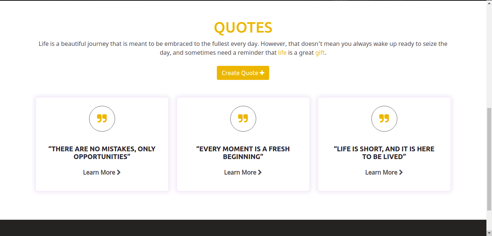
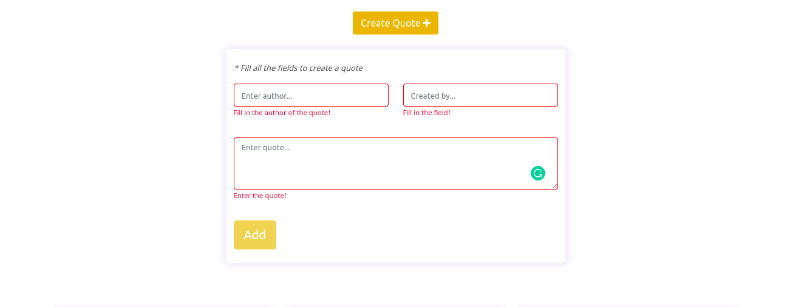
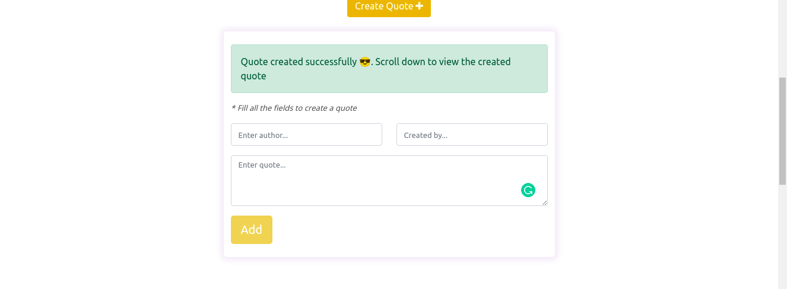
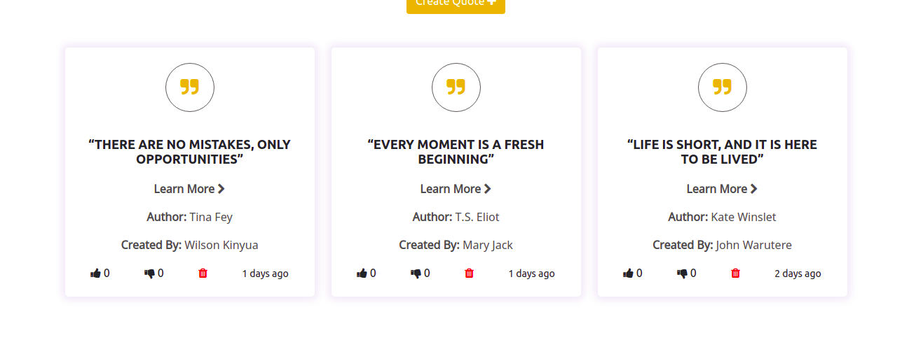

<!-- # Quote Generator

This project was generated with [Angular CLI](https://github.com/angular/angular-cli) version 12.2.1.

## Development server

Run `ng serve` for a dev server. Navigate to `http://localhost:4200/`. The app will automatically reload if you change any of the source files.

## Code scaffolding

Run `ng generate component component-name` to generate a new component. You can also use `ng generate directive|pipe|service|class|guard|interface|enum|module`.

## Build

Run `ng build` to build the project. The build artifacts will be stored in the `dist/` directory.

## Running unit tests

Run `ng test` to execute the unit tests via [Karma](https://karma-runner.github.io).

## Running end-to-end tests

Run `ng e2e` to execute the end-to-end tests via a platform of your choice. To use this command, you need to first add a package that implements end-to-end testing capabilities.

## Further help

To get more help on the Angular CLI use `ng help` or go check out the [Angular CLI Overview and Command Reference](https://angular.io/cli) page. -->

# Quote Generator

#### Created By Wilson Kinyua Muthoni on 30-07-2021
## Description
Week 1 Independent Project | Quote Generator at Moringa School Core (Angular Module). A web application where  users can create quotes and have those quotes voted on whether they are terrible or are inspirational. 
## Setup Requirements
* Git
* Web-browser or your choice
* Github
* Angular CLI (https://cli.angular.io/)
* Node.js (https://nodejs.org/)
* NPM (https://www.npmjs.com/)

## Setup Installation
* Copy the github repository url
* Clone to your computer
* Open terminal and navigate to the directory of the project you just cloned to your computer 
* Run the following command to install all the dependencies
``` 
npm install
```
* And the following to run development server
```
ng serve
```
* open the browser and navigate to http://localhost:4200/ to see the application in action
## Technologies Used
 The following languages have been used on this project:
 * HTML
 * CSS
 * Bootstrap
 * Angular CLI

## Setup/Installation Requirements

* Live link to view the project <a href="https://wilsonkinyua.github.io/quote-generator/">View Quotes</a>
## Some Screenshots
* Homepage


* Quote section


* Create Quote Form with form validation


* After submitting the form


* Single Quote Details
 

* Fully Phone Responsive
<br>


## Known Bugs
 So far so good there are no bugs related to this project 😎
## Support and contact details 🙂
To make a contribution to the code used or any suggestions you can click on the contact link and email me your suggestions.
* Email: wilson@developerwilson.com
* Phone: +254717255460
## License


Copyright (c) 2021 Moringa school

Permission is hereby granted, free of charge, to any person obtaining a copy
of this software and associated documentation files , to deal
in the Software without restriction, including without limitation the rights
to use, copy, modify, merge, publish, distribute, sublicense, and/or sell
copies of the Software, and to permit persons to whom the Software is
furnished to do so, subject to the following conditions:

The above copyright notice and this permission notice shall be included in all
copies or substantial portions of the Software.

THE SOFTWARE IS PROVIDED "AS IS", WITHOUT WARRANTY OF ANY KIND, EXPRESS OR
IMPLIED, INCLUDING BUT NOT LIMITED TO THE WARRANTIES OF MERCHANTABILITY,
FITNESS FOR A PARTICULAR PURPOSE AND NONINFRINGEMENT. IN NO EVENT SHALL THE
AUTHORS OR COPYRIGHT HOLDERS BE LIABLE FOR ANY CLAIM, DAMAGES OR OTHER
LIABILITY, WHETHER IN AN ACTION OF CONTRACT, TORT OR OTHERWISE, ARISING FROM,
OUT OF OR IN CONNECTION WITH THE SOFTWARE OR THE USE OR OTHER DEALINGS IN THE
SOFTWARE.

  